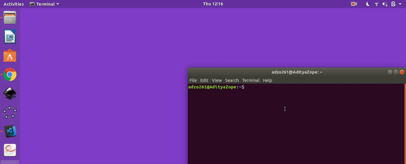

[](https://github.com/adzo261/todo-wallpaper-cli/blob/master/LICENSE.txt)

# Todo Wallpaper CLI

> Create and remove todo tasks and set as wallpaper using command line.

- Always keep todo tasks infront of eyes as a wallpaper
- No more GUI application or extensions to view and manage tasks.

#### Note
Currently, wallpaper can be set only on Ubuntu(GNOME).

## Demo


## Usage

| Commands             |              Functions               |
| -------------------- | :----------------------------------: |
| `$ todo`             |         Lists all the tasks          |
| `$ todo -a "String"` |         Adds String to tasks         |
| `$ todo -rm a,b,c,d` | Removes tasks with ID's a,b,c and d. |
| `$ todo -rm all`     |          Removes all tasks           |
| `$ todo --help`      |               For help               |


## Development setup
Fork it and clone as local repository.
```sh
$ cd todo-wallpaper-cli
$ virtualenv venv
$ . venv/bin/activate
$ pip install requirements.txt
$ pip install --editable .
```
## Contributing

1. Fork it (<https://github.com/adzo261/todo-wallpaper-cli/fork>)
2. Create your feature branch (`git checkout -b feature/fooBar`)
3. Commit your changes (`git commit -am 'Add some fooBar'`)
4. Push to the branch (`git push origin feature/fooBar`)
5. Create a new Pull Request

